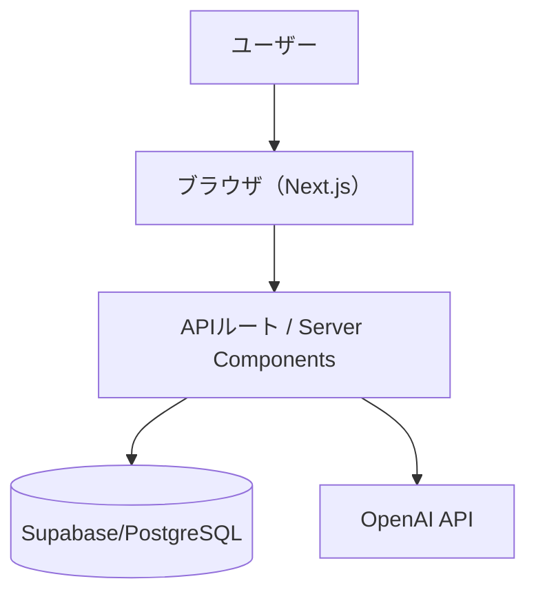
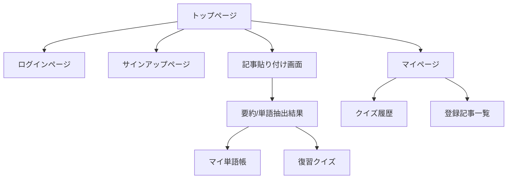
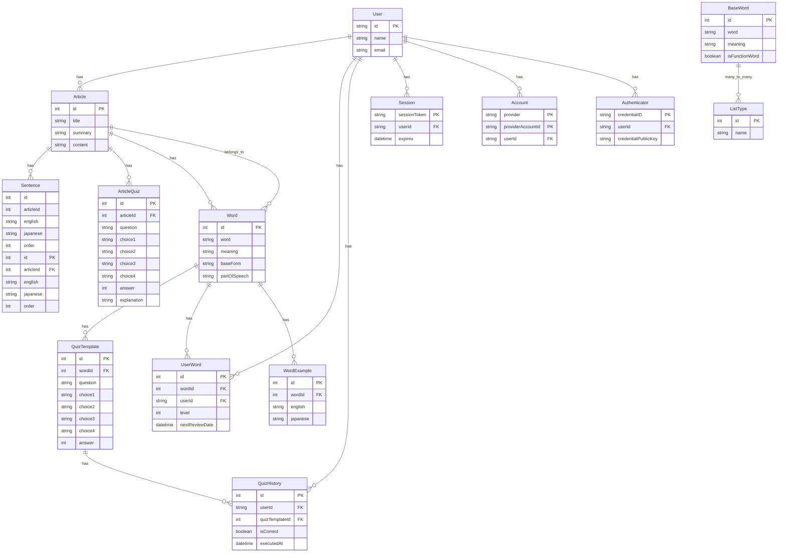
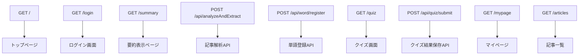

# 設計書 - LangBoost

LangBoost は、ニュース記事を活用して英語語彙力を効率的に強化するための語学学習支援アプリです。  
本ドキュメントではアーキテクチャ、画面構成、データベース設計、API構成について記載します。

---

## 🧭 概要設計（アーキテクチャ）

```mermaid
graph TD
  User[ユーザー]
  Browser[ブラウザ（Next.js）]
  Server[APIルート / Server Components]
  DB[(Supabase/PostgreSQL)]
  OpenAI[OpenAI API]

  User --> Browser
  Browser --> Server
  Server --> DB
  Server --> OpenAI
```

## 📚 画面遷移図

```mermaid
graph TD
  TOP[トップページ] --> LOGIN[ログインページ]
  TOP --> SIGNUP[サインアップページ]
  TOP --> INPUT[記事貼り付け画面]
  INPUT --> SUMMARY[要約/単語抽出結果]
  SUMMARY --> WORDLIST[マイ単語帳]
  SUMMARY --> QUIZ[復習クイズ]
  TOP --> MYPAGE[マイページ]
  MYPAGE --> QUIZHISTORY[クイズ履歴]
  MYPAGE --> ARTICLES[登録記事一覧]
```

## 🧩 ER図

```mermaid
erDiagram
  User ||--o{ Article : has
  User ||--o{ UserWord : has
  User ||--o{ QuizHistory : has
  User ||--o{ Session : has
  User ||--o{ Account : has
  User ||--o{ Authenticator : has

  Article ||--o{ Sentence : has
  Article ||--o{ ArticleQuiz : has
  Article ||--o{ Word : has

  Word ||--o{ QuizTemplate : has
  Word ||--o{ UserWord : has
  Word ||--o{ WordExample : has
  Word }o--|| Article : belongs_to

  BaseWord ||--o{ ListType : many_to_many

  QuizTemplate ||--o{ QuizHistory : has

  Sentence {
    int id
    int articleId
    string english
    string japanese
    int order
  }

  Word {
    int id PK
    string word
    string meaning
    string baseForm
    string partOfSpeech
  }

  User {
    string id PK
    string name
    string email
  }

  UserWord {
    int id PK
    int wordId FK
    string userId FK
    int level
    datetime nextReviewDate
  }

  QuizHistory {
    int id PK
    string userId FK
    int quizTemplateId FK
    boolean isCorrect
    datetime executedAt
  }

  QuizTemplate {
    int id PK
    int wordId FK
    string question
    string choice1
    string choice2
    string choice3
    string choice4
    int answer
  }

  Article {
    int id PK
    string title
    string summary
    string content
  }

  Sentence {
    int id PK
    int articleId FK
    string english
    string japanese
    int order
  }

  WordExample {
    int id PK
    int wordId FK
    string english
    string japanese
  }

  ArticleQuiz {
    int id PK
    int articleId FK
    string question
    string choice1
    string choice2
    string choice3
    string choice4
    int answer
    string explanation
  }

  BaseWord {
    int id PK
    string word
    string meaning
    boolean isFunctionWord
  }

  ListType {
    int id PK
    string name
  }

  Session {
    string sessionToken PK
    string userId FK
    datetime expires
  }

  Account {
    string provider PK
    string providerAccountId PK
    string userId FK
  }

  Authenticator {
    string credentialID PK
    string userId FK
    string credentialPublicKey
  }


```

## 🌐 URL / API 設計

```mermaid
graph TB
  route1[GET /] --> top[トップページ]
  route2[GET /login] --> login[ログイン画面]
  route3[GET /summary] --> summary[要約表示ページ]
  route4[POST /api/analyzeAndExtract] --> analyze[記事解析API]
  route5[POST /api/word/register] --> reg[単語登録API]
  route6[GET /quiz] --> quiz[クイズ画面]
  route7[POST /api/quiz/submit] --> submit[クイズ結果保存API]
  route8[GET /mypage] --> mypage[マイページ]
  route9[GET /articles] --> articles[記事一覧]
```