# 設計書 - LangBoost

LangBoost は、ニュース記事を活用して英語語彙力を効率的に強化するための語学学習支援アプリです。  
本ドキュメントではアーキテクチャ、画面構成、データベース設計、API構成について記載します。

---

## 🧭 概要設計（アーキテクチャ）

```mermaid
graph TD
  User[ユーザー]
  Browser[ブラウザ（Next.js）]
  Server[APIルート / Server Components]
  DB[(Supabase/PostgreSQL)]
  OpenAI[OpenAI API]

  User --> Browser
  Browser --> Server
  Server --> DB
  Server --> OpenAI
```

## 📚 画面遷移図

```mermaid
graph TD
  TOP[トップページ] --> LOGIN[ログインページ]
  TOP --> SIGNUP[サインアップページ]
  TOP --> INPUT[記事貼り付け画面]
  INPUT --> SUMMARY[要約/単語抽出結果]
  SUMMARY --> WORDLIST[マイ単語帳]
  SUMMARY --> QUIZ[復習クイズ]
  TOP --> MYPAGE[マイページ]
  MYPAGE --> QUIZHISTORY[クイズ履歴]
  MYPAGE --> ARTICLES[登録記事一覧]
```

## 🧩 ER図

## 🌐 URL / API 設計

```mermaid
graph TB
  route1[GET /] --> top[トップページ]
  route2[GET /login] --> login[ログイン画面]
  route3[GET /summary] --> summary[要約表示ページ]
  route4[POST /api/analyzeAndExtract] --> analyze[記事解析API]
  route5[POST /api/word/register] --> reg[単語登録API]
  route6[GET /quiz] --> quiz[クイズ画面]
  route7[POST /api/quiz/submit] --> submit[クイズ結果保存API]
  route8[GET /mypage] --> mypage[マイページ]
  route9[GET /articles] --> articles[記事一覧]
```

