# 設計書 - LangBoost

LangBoost は、ニュース記事を活用して英語語彙力を効率的に強化するための語学学習支援アプリです。  
本ドキュメントではアーキテクチャ、画面構成、データベース設計、API構成について記載します。

---

## 🧭 概要設計（アーキテクチャ）

```mermaid
graph TD
  User[ユーザー]
  Browser[ブラウザ（Next.js）]
  Server[APIルート / Server Components]
  DB[(Supabase/PostgreSQL)]
  OpenAI[OpenAI API]

  User --> Browser
  Browser --> Server
  Server --> DB
  Server --> OpenAI
```

## 📚 画面遷移図

```mermaid
graph TD
  TOP[トップページ] --> LOGIN[ログインページ]
  TOP --> SIGNUP[サインアップページ]
  TOP --> INPUT[記事貼り付け画面]
  INPUT --> SUMMARY[要約/単語抽出結果]
  SUMMARY --> SUMMARYQUIZ[記事内復習クイズ]
  TOP --> MYPAGE[マイページ]
  MYPAGE --> WORDLIST[マイ単語帳]
  WORDLIST --> WORDQUIZ[単語帳クイズ]
  MYPAGE --> QUIZHISTORY[クイズ履歴]
  MYPAGE --> ARTICLES[登録記事一覧]
```

## 🧩 ER図

## 🌐 URL / API 設計

### 🔹 ページルーティング（画面表示）

- `GET /`  
  → トップページ

- `GET /login`  
  → ログインページ

- `GET /summary`  
  → 記事の要約・単語抽出結果ページ

- `GET /quiz`  
  → 単語帳からの復習クイズページ

- `GET /mypage`  
  → マイページ

- `GET /articles`  
  → 登録記事一覧ページ

- `GET /words`  
  → マイ単語帳ページ

- `GET /quiz/history`  
  → クイズ履歴ページ

---

### 🔹 API エンドポイント

- `POST /api/analyzeAndExtract`  
  → 記事の要約＋単語抽出（OpenAI連携）

- `POST /api/word/register`  
  → 単語の登録処理（UserWord 作成）

- `POST /api/quiz/submit`  
  → クイズの解答送信・履歴記録
